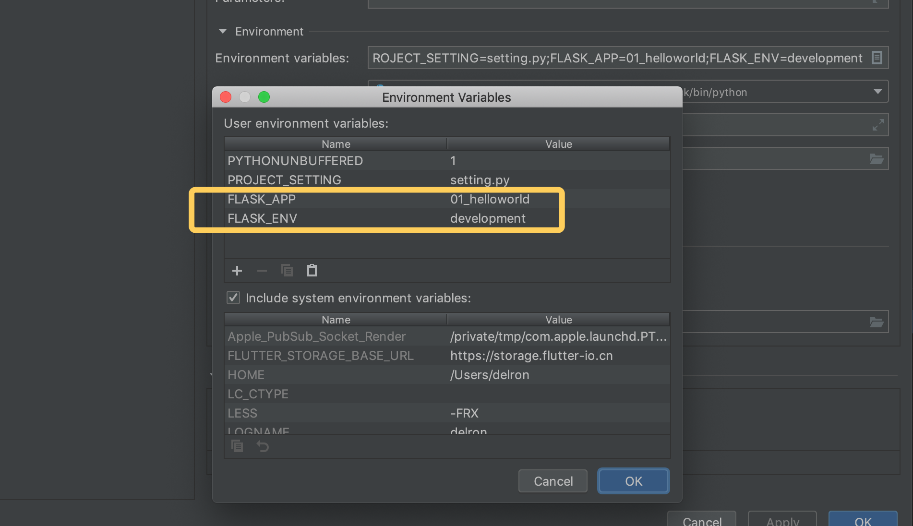
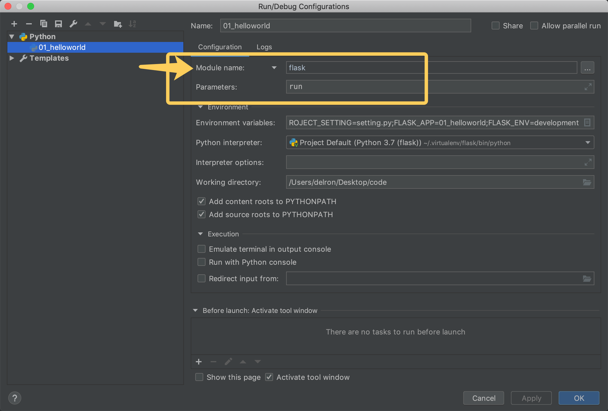

# Flask
## Introduction to Flask
### 1. Flask
Flask was born in 2010, is Armin ronacher (human name) in Python language based on the Werkzeug toolkit written lightweight web development framework.

Flask itself is equivalent to a kernel , almost all other features have to use extensions ( mail extension Flask-Mail, user authentication Flask-Login, database Flask-SQLAlchemy), all need to use third-party extensions to achieve . For example, we can use Flask extensions to add ORM, form validation tools, file uploads, authentication, etc. Flask does not have a default database to use, we can choose MySQL, we can also use NoSQL.

Its WSGI toolkit using Werkzeug (routing module), the template engine uses Jinja2. These two are also the core of the Flask framework.

### 2. Framework Comparison
#### Lightness of the framework
Heavyweight framework: to facilitate the development of business programs, provides a wealth of tools, components, such as Django

lightweight framework: only provide the core functions of the Web framework , free, flexible, highly customizable , such as Flask, Tornado

#### Comparison with Django
django provides:

 - django-admin to quickly create a project works directory

 - manage.py to manage project works

 - orm model (database abstraction layer)

 - admin backend to manage the site

 - Caching mechanism

 - File storage system

 - user authentication system

All of these, flask do not have, need to extend the package to provide.

### 3. Common Expansion Packs
List of extensions: http://flask.pocoo.org/extensions/
 - Flask-SQLalchemy: manipulating databases;
 - Flask-script: inserting scripts;
 - Flask-migrate: managing migrated databases;
 - Flask-Session: session storage method specification;
 - Flask-WTF: forms;
 - Flask-Mail: mail;
 - Flask-Bable: provide internationalization and localization support, translation;
 - Flask-Login: authenticate user status;
 - Flask-OpenID: authentication;
 - Flask-RESTful: tools for developing REST APIs;
 - Flask-Bootstrap: integration of front-end Twitter Bootstrap framework;
 - Flask-Moment: localized date and time;
 - Flask-Admin: a simple and extensible framework for managing interfaces

## Project management
### 1. Environment Installation
#### Virtual environments and the pip command
```bash
# Virtual environments
mkvirtualenv # Create virtual environment
rmvirtualenv # delete virtual environments
workon # enter virtual environment, view all virtual environments
deactivate # exit a virtual environment

# pip
pip install # Install dependent packages
pip uninstall # Uninstall dependencies
pip list # View installed dependencies
pip freeze # Freeze dependencies for the current environment.

# Create a Virtual Environment
python3 -m venv flask-env
source flask-env/bin/activate
# Install Flask
pip3 install flask
```
### 2. Flask Programming
 - Create the helloworld.py file
```python
# Importing Flask Classes
from flask import Flask

# The Flask class takes one parameter, __name__.
app = Flask(__name__)


# Define the view
# The role of the decorator is to map routes to the view function index
@app.route('/')
def index():
    return 'hello world'


# The run method of a Flask application instance starts the WEB server.
if __name__ == '__main__':
    app.run()
```
 - run
```bash
python3 helloworld.py
 ```

### 3. Parameter description
#### Flask object initialization parameters
When a Flask program instance is created, it needs to be passed the package (module) specified by the current Flask program by default.

 - import_name
   - The package (module) that the Flask program is in. Pass `__name__` and you're done.
   - This determines the path Flask looks for when accessing static files.
 - static_url_path
   - static_url_path, can be passed without, the default is: `/ + static_folder`
 - static_folder
   - The folder where static files are stored, can be left out, default is `static`.
 - template_folder
   - The folder where template files are stored, can not be passed, default is `templates`.
#### Application Configuration Parameters
Unlike Django, which puts all configuration information in the settings.py file.

Flask saves the configuration information into the `app.config` property, which can be manipulated by dictionary type.

Read

 - `app.config.get(name)`

 - `app.config[name]`

Set up
1. Load from Configuration Object
`app.config.from_object(configuration object)`
```python
class DefaultConfig(object):
    SECRET_KEY = 'TPmi4aLWRbyVq8zu9v82dWYW1'

app = Flask(__name__)

app.config.from_object(DefaultConfig)

@app.route("/")
def index():
    print(app.config['SECRET_KEY'])
    return "hello world"
```
 - Application Scenario: 
   - Written as a default configuration in program code
 - Benefits: Inheritance, reuse
 - Cons: Exposure of sensitive data
2. Load from configuration file
`app.config.from_pyfile(config file)`
```python
# setting.py
SECRET_KEY = 'TPmi4aLWRbyVq8zu9v82dWYW1'

# flaskprogram.py
app = Flask(__name__)

app.config.from_pyfile('setting.py')

@app.route("/")
def index():
    print(app.config['SECRET_KEY'])
    return "hello world"
```
 - Application Scenario:
    - Use a fixed configuration file in the project
 - Benefits: Separate files Protect sensitive data
 - Cons: Fixed file paths Inflexible
3. Load from environment variables
`app.config.from_envvar('environment variable name')`
   
The essence of Flask's use of environment variables to load configurations is to find the configuration file through the environment variable values and then read the configuration file's information.
```bash
# The value of the environment variable is the absolute path to the configuration file
export PROJECT_SETTING='~/setting.py'
```
```python
app = Flask(__name__)

app.config.from_envvar('PROJECT_SETTING', silent=True)

@app.route("/")
def index():
    print(app.config['SECRET_KEY'])
    return "hello world"
```
- Application Scenario:
    -  The address of the configuration file is not fixed;
    - Don't want to expose the real configuration file address in the code, and only have information about the real configuration file on the server running the code.
- Benefits: Separate files Protection of sensitive data Variable file paths Flexibility
- Cons: inconvenient Remember to set environment variables
A note about silent:

Indicates whether to throw an exception if the corresponding value is not set in the system environment variable
 - False means no silent processing, no value error notification, the default is False.
 - True means silent processing, even if there is no value, let Flask run normally.

Setting and reading environment variables on a Linux system is done as follows:
```bash
export variable name = variable value # set
echo $variable name # read

# For example
export language=python
echo $language
```
#### Common approaches in projects
Creating a Flask app using the factory pattern and loading configuration using a combination of configuration objects and environment variables
 - Use configuration objects to load the default configuration
 - Use environment variables to load sensitive configuration information that you don't want to see in your code.
```python
from flask import Flask


def create_flask_app(config):
    app = Flask(__name__)
    app.config.from_object(config)

    app.config.from_envvar("PROJECT_SETTING", silent=True)
    return app


class DefaultConfig(object):
    SECRET_KEY = 'alex'


class DevelopmentConfig(DefaultConfig):
    DEBUG=True

    
app = create_flask_app(DevelopmentConfig)

@app.route("/")
def index():
    print(app.config['SECRET_KEY'])
    return "hello world"
```
#### app.run parameter
`app.run(host="0.0.0.0", port=5000, debug=True)`

About DEBUG debugging mode:
 - The server can be restarted automatically after the program code is modified.
 - When the server error occurs, we can directly return the error information to the front-end for display.

### 4. Development server startup method
#### Terminal Launch
```bash
$ export FLASK_APP=helloworld
$ flask run
 * Running on http://127.0.0.1:5000/
```
Description

 - The FLASK_APP environment variable specifies the instance where flask is started.
 - flask run -h 0.0.0.0 -p 8000 bind address port
 - flask run --help Get help.
 - Control of production and development modes
 - Indicated by the FLASK_ENV environment variable
   - export FLASK_ENV=production 
     - Runs in production mode, or defaults to that mode if not specified.
   - export FLASK_ENV=development 
     - Runs in development mode.

Extensions
```bash
$ export FLASK_APP=helloworld
$ python -m flask run
  * Running on http://127.0.0.1:5000/
```
#### Pycharm Launch



## Routing and blueprints
### 1. Router
```python
@app.route("/")
def index():
    return "hello world"
```
#### Query Routing Information
 - Command-line method
```bash
export FLASK_APP=helloworld_production
flask routes
```
```bash
Endpoint  Methods  Rule
--------  -------  -----------------------
index     GET      /
static    GET      /static/
```
 - Get it in the program
   - The url_map attribute in the application holds the route mapping information for the entire Flask application, and you can get the routing information by reading this attribute
    ```python
    print(app.url_map)
    ```
   - If we want to traverse the routing information in our program, we can do it as follows
    ```python
    for rule in app.url_map.iter_rules():
        print('name={} path={}'.format(rule.endpoint, rule.rule))
    ```
```python
# Requirement
# Return all routing information within the application in json via /

# Realization
@app.route('/')
def route_map():
    """Main view, return all view URLs"""
    rules_iterator = app.url_map.iter_rules()
    return json.dumps({rule.endpoint: rule.rule for rule in rules_iterator})
```
#### Specify the request method
In Flask, define routes whose default request method is:
 - GET
 - OPTIONS(included) -> Simplified version of a GET request to ask for server interface information
   - For example, the type of request allowed by the interface, the allowed request source domain name
   - CORS cross-domain: django-cors -> The options request is intercepted and processed in the middleware.
   - www.lemonmall.site -> api/lemonmall.site/users/1
     - Return response -> allow-origin 'www.lemonmall.site'
     - GET api.lemonmall.site/users/1
 - HEAD (included) -> Simplified version of GET request
   - Returns only the response header when a GET request is processed, not the response body

The methods parameter allows you to specify your own request method for an interface.

Customized POST PUT DELETE PATCH

405 Method Not Allowed
```python
@app.route("/route1", methods=["POST"])
def view_func_1():
    return "hello world 1"

@app.route("/route2", methods=["GET", "POST"])
def view_func_2():
    return "hello world 2"
```

### 2. Blueprint
#### Demand
In a Flask application project, if there are too many business views, is it possible to maintain the business units divided in a certain way, and separate the views, static files, template files, etc. used by each unit?

For example, from the business point of view, the entire application can be divided into user module unit, product module unit, order module unit, how to develop these different units, and ultimately integrated into a project application?

#### Blueprint
In Flask, the Blueprint is used to organize the management in modules.

A Blueprint can actually be understood as a container object that stores a set of view methods with the following characteristics:

 - An application can have multiple Blueprints
 - A Blueprint can be registered to any unused URL such as “/user”, “/goods”.
 - Blueprints can have their own templates, static files, or other common methods, and are not required to implement the application's views and functions.
 - Blueprints should be registered when an application is initialized.

But a Blueprint is not a complete application, it can not run independently of the application, but must be registered to an application.
#### Usage
Using a blueprint can be broken down into three steps:
1. Create a blueprint object
```python
user_bp=Blueprint('user',__name__)
```
2. Operate on this blueprint object, register routes, specify static folders, register template filters
```python
@user_bp.route('/')
def user_profile():
    return 'user_profile'
```
3. Register this blueprint object with the application object
```python
app.register_blueprint(user_bp)
```

Single file blueprints
 - Can create blueprint objects and define views in a single file.

Catalog (package) blueprints
 - For a blueprint that is intended to contain multiple files, it is common to place the creation of the blueprint object in the Python package's `__init__.py` file.

```bash
--------- project # Project Catalog
  |------ main.py # Startup file
  |------ user  # User blueprint
  |  |--- __init__.py  # Create blueprint objects here
  |  |--- passport.py  
  |  |--- profile.py
  |  |--- ...
  |
  |------ goods # Commodity Blueprint
  |  |--- __init__.py
  |  |--- ...
  |...
```

#### Extended Usage
 - Specify the url prefix of the blueprint
   - Use the url_prefix parameter when registering the blueprint in the application to specify
   ```python
    app.register_blueprint(user_bp, url_prefix='/user')
    app.register_blueprint(goods_bp, url_prefix='/goods')
    ```
 - Blueprint internal static files
   - Unlike application objects, blueprint objects do not register static directory routes by default when they are created. We need to specify the static_folder parameter at creation time.
   - The following example sets the static_admin directory in the directory where the blueprint is located to the static directory
   ```python
    admin = Blueprint("admin",__name__,static_folder='static_admin')
    app.register_blueprint(admin,url_prefix='/admin')
    ```
   - Static files in the `static_admin` directory can now be accessed using `/admin/static_admin/<filename>`.
   - The access path can also be changed with `static_url_path`.
   ```python
    admin = Blueprint("admin",__name__,static_folder='static_admin',static_url_path='/lib')
    app.register_blueprint(admin,url_prefix='/admin')
    ```
 - Blueprint Internal Template Catalog
   - The default template directory for blueprint objects is the system's template directory, which can be set using the template_folder keyword parameter when creating a blueprint object.
   ```python
    admin = Blueprint('admin',__name__,template_folder='my_templates')
    ```
### Return Json
 - return jsonify
   - Convert to json format
   - Set the response header Content-Type:application/json
### Building response headers and status codes

## Request and Response
### 1. Processing requests
Requirement

When we need to read the data carried by a client request in view writing, how can we get the data out correctly?

The data carried by the request may appear in different places in the HTTP message, and different methods need to be used to get the parameters.

#### URL path parameters (dynamic routing)
For example, there is a request to access the interface address /users/123, where 123 is actually a specific request parameter indicating that information about user 123 is requested. At this point how do we extract the 123 data from the url?

Unlike Django, which writes regular expressions directly when defining routes, Flask uses a converter syntax:
```python
@app.route('/users/<user_id>')
def user_info(user_id):
    print(type(user_id))
    return 'hello user {}'.format(user_id)
```
The <> here is a converter, which defaults to a string type, i.e., it matches the data at this location in string format and passes it into the view with string as the datatype type and user_id as the parameter name.

#### Flask also provides other types of converters
```bash
DEFAULT_CONVERTERS = {
    'default':          UnicodeConverter,
    'string':           UnicodeConverter,
    'any':              AnyConverter,
    'path':             PathConverter,
    'int':              IntegerConverter,
    'float':            FloatConverter,
    'uuid':             UUIDConverter,
}
```
```python
@app.route('/users/<int:user_id>')
def user_info(user_id):
    print(type(user_id))
    return 'hello user {}'.format(user_id)


@app.route('/users/<int(min=1):user_id>')
def user_info(user_id):
    print(type(user_id))
    return 'hello user {}'.format(user_id)
```
#### Customized converters
If we encounter the need to match the cell phone number data extracted from /sms_codes/18512345678, Flask's built-in converter will not be able to meet the demand, this time we need to customize the converter.

Definition method(Customizing the converter is done in 3 main steps)
 - Create a converter class that holds the regular expression when matched
    ```python
   from werkzeug.routing import BaseConverter
   
   class MobileConverter(BaseConverter):
       """
       Mobile phone
       """
       regex = r'1[3-9]\d{9}'
   ```
   - Note that the name regex is fixed
 - Inform Flask apps about customized converters
   ```python
   app = Flask(__name__)
   
   # Add the custom converter to the converter dictionary and specify that the converter is used with the name: mobile
   app.url_map.converters['mobile'] = MobileConverter
   ```
 - Define the use of converters where they are used
   ```python
   @app.route('/sms_codes/<mobile:mob_num>')
   def send_sms_code(mob_num):
       return 'send sms code to {}'.format(mob_num)
   ```
#### Other parameters
If we want to get the parameters passed elsewhere, we can read them through the request object provided by Flask.

The parameters in different locations are stored in different properties of the request.

Properties	| Description      | Types  
---|------------------|-----|
data	| Logging the requested data and converting it to a string	 | *   
form	|Logging form data in requests|	MultiDict
args	|Query parameters in logging requests|	MultiDict
cookies	|Logging cookie information in requests|	Dict
headers	|Record the headers in the request|	EnvironHeaders
method	|Log the HTTP method used for the request	|GET/POST
url	|Record the URL address of the request|	string
files	|Logging of files requested for upload	|*

To get the parameter channel_id in request/articles?channel_id=1, we can use it as follows:
```python
from flask import request

@app.route('/articles')
def get_articles():
    channel_id = request.args.get('channel_id')
    return 'you wanna get articles of channel {}'.format(channel_id)
```

#### Upload a picture
Client uploads an image to the server and saves it to the server
```python
from flask import request

@app.route('/upload', methods=['POST'])
def upload_file():
    f = request.files['pic']
    # with open('./demo.png', 'wb') as new_file:
    #     new_file.write(f.read())
    f.save('./demo.png')
    return 'ok'
```
